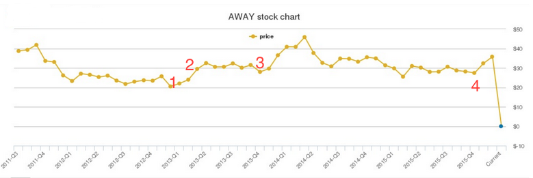

# HomeAway/Vrbo: Testing That Drove a $3.9 Billion Acquisition

Between 2012 and 2015, I managed testing efforts for the initiatives that transformed HomeAway from a listing-fee business into a transactional marketplace. These weren't incremental improvements — they were bet-the-company product launches that fundamentally changed how vacation rental revenue worked.

## The Stock Chart

Products delivered outperformed expectations, resulting in significant revenue growth and a stock rise of greater than 20% for 2013-2014. The steep drop at the end corresponds to the acquisition by Expedia and subsequent delisting of AWAY stock.

**Expedia acquired HomeAway in December 2015 for $3.9 billion.**

## Scale

At peak, I managed a globally distributed team of 63 testers — FTEs (ICs and managers) and contract workers across multiple vendors and locales. I also led cross-product testing initiatives involving over 100 testers. These weren't isolated test plans — they were company-wide programs reported to executive leadership weekly.

## The Initiatives

**Online Booking (2012)** — HomeAway's first transactional product. Travelers could book and pay online instead of contacting owners directly. My team led testing across the full payment flow — UI, API, database, third-party payment integration. This was the foundation everything else was built on.

**Pay-per-Booking / Performance-Based Model (2013)** — A new revenue model where property managers paid per booking instead of flat annual listing fees. This opened the platform to smaller operators who couldn't afford $1,000+/year upfront. My team tested the billing engine, reporting dashboards, and integration across multiple HomeAway brands.

**Interhome Partnership / Online Booking Expansion (2013)** — Extended online booking to Interhome's European inventory, then rolled it out across all HomeAway brands globally. Cross-locale testing, multi-currency payment flows, regulatory compliance across markets.

**Traveler Service Fee (2016)** — The controversial 5-10% booking fee on travelers. "Wildly profitable but massively unpopular." My team tested the fee calculation engine, display logic, and edge cases across every product line and locale.

---

## Source Articles

### 1. HomeAway Launches Online Booking (November 5, 2012)

*Original URL: https://www.homeaway.com/info/media-center/press-releases/2012/online-booking*
*Archived: https://web.archive.org/web/20170319225342/https://www.homeaway.com/info/media-center/press-releases/2012/online-booking*

AUSTIN, Texas, November 5, 2012 — HomeAway, Inc. (NASDAQ: AWAY), the world's leading online marketplace of vacation rentals, today announces the launch of online booking, a new service on HomeAway.com and VRBO.com that enables travelers to enjoy the convenience of securing a vacation home rental online with a credit card.

Online booking provides vacation rental home owners a faster way to confirm bookings and satisfies the growing traveler demand for a familiar, secure online booking experience.

By selecting "Book It" travelers immediately send a paid reservation request directly to the homeowner. However, the traveler is not charged until the owner confirms the reservation, which they have up to 24 hours to do. The review period was built into the process to allow time for the owner to communicate with the traveler, if need be. Communication between the owner and their prospective guest is a critical part of booking a vacation rental, and it's a step the majority of travelers (70 percent) really enjoy, according to HomeAway research.

"This is a big step forward for the company," says Brian Sharples, chief executive officer of HomeAway. "As owners adopt this service, it will ensure more accurate availability calendars, encourage quicker owner response and, overall, create a much better and more efficient experience for travelers."

---

### 2. HomeAway Unveils Performance-Based Model & Professional Referral Network (2013)

*Original URL: https://www.homeaway.com/info/media-center/press-releases/2013/homeaway-unveils-performance-based-model--professional-referral*
*Archived: https://web.archive.org/web/20150413130750/http://www.homeaway.com/info/media-center/press-releases/2013/homeaway-unveils-performance-based-model--professional-referral*

In an effort to eliminate some of the barriers to entry for vacation rental home owners and professional managers, HomeAway, Inc. (NASDAQ: AWAY), the world's leading online marketplace for vacation rentals, today officially launches two new services; a pay-per-booking model and its new Professional Referral Network. Pay-per-booking provides owners and property managers on HomeAway.com the opportunity to pay just 10 percent of the booking each time the home is booked, with no up-front subscription fee. In conjunction with this pay-for-performance model, HomeAway also debuts the Professional Referral Network, which is a first-of-its kind directory connecting new HomeAway.com owners to professional property management services during the sign-up process.

The new HomeAway.com pay-per-booking model provides an alternative to the company's existing subscription offering and is ideal for owners new to HomeAway.com or renting in general, giving them an opportunity to test the performance of the site for no up-front cost. In addition, pay-per-booking is targeted at those renting properties for six weeks or less, including owners in seasonal destinations or cities that host popular events such as the Super Bowl, South by Southwest Music Festival or the World Cup. HomeAway believes this service will also benefit large property management companies that have historically advertised only a subset of their properties due to cash constraints that preclude them from paying subscription fees in advance for all of their properties.

Unlike several performance-based companies in the industry, HomeAway continues not to charge travelers a booking fee.

"With no up-front fee, our pay-per-booking model allows new customers to try our sites before committing to an annual subscription, and it also gives short-season renters a low cost way to cover their expenses or help pay their mortgage with a few bookings," says HomeAway CEO, Brian Sharples. "But for most customers on HomeAway, an annual subscription still remains the best value."

With the launch of the Professional Referral Network, HomeAway updated its listing process to give owners the following options:

**List Your Property Yourself** — Owners choose an annual subscription or the new pay-per-booking model, and oversee the marketing, management and guest services of their vacation rental home.

**Marketing and Booking Services** — Through the Professional Referral Network, owners are directed to a partner company to build their listing, secure sort order on HomeAway.com and handle all inquiries and reservations. Owners will oversee the onsite management of the vacation rental. The owner pays a commission, which varies from partner to partner, and HomeAway receives a guaranteed subscription from the property management company.

**Full-service** — This option points owners to a directory of property managers offering a broad range of on-site management services including key drop, maintenance and more, in addition to the marketing and booking services noted above.

At launch, 40 professional management companies including Evolve Vacation Rental Network, No Worries Vacation Rentals, Southern California Vacation Rentals and Turnkey Vacation Rentals joined the Professional Referral Network.

---

### 3. HomeAway Announces Partnership with Interhome (November 20, 2013)

*Original URL: https://www.homeaway.com/info/media-center/press-releases/2013/homeaway-announces-partnership-with-interhome-to-add-online-book*
*Archived: https://web.archive.org/web/20150310132629/http://www.homeaway.com/info/media-center/press-releases/2013/homeaway-announces-partnership-with-interhome-to-add-online-book*

November 20, 2013 — HomeAway, Inc. (NASDAQ: AWAY), the world's leading online marketplace for vacation rentals, has expanded its distribution partnership with Europe's leading professionally managed vacation rental company, Interhome AG, to add new listings to HomeAway's network via its pay-per-booking product.

It is expected that this partnership will add tens of thousands of online bookable vacation rentals to HomeAway in the coming months. Properties will first appear on its U.S. sites, HomeAway.com and VRBO.com, and European sites, FeWo-direkt and HomeAway.co.uk. Interhome's properties will later become available on additional sites around the world, like Abritel.fr in France, as HomeAway rolls out its pay-per-booking functionality.

To date, this is the largest distribution partnership enabled by HomeAway's pay-per-booking product for property managers, which launched earlier this month.

"We're excited to have a close integration with one of the largest and oldest companies in the business that enables our customers to receive quotes and book vacation rentals online," says HomeAway CEO Brian Sharples. "We expect this is the beginning of many relationships with leading property managers, like Interhome, that will ultimately provide family and group vacationers with a high level of service."

Founded in 1965, Switzerland-based Interhome is the operator of 15 regional subsidiaries and is one of Europe's premier providers of professionally managed vacation rentals worldwide, with a concentration of listings in France, Italy, Spain and Switzerland.

"Working with HomeAway is a great fit because both companies passionately believe that vacations are not just about where you go, but where you stay," says Interhome CEO Simon Lehman. "We look forward to helping even more families and groups create lasting memories with a level of service and comfort they'll never forget."

**About Interhome AG:** Interhome AG (www.interhome.com) specializes in the rental of more than 32,000 quality holiday apartments, homes and chalets in 31 countries worldwide. In 2012, the company welcomed 535,000 holiday guests and recorded a net yield of CHF 181 million.

---

### 4. Why HomeAway's New Fee Makes Sense

*Tim Calkins, March 29, 2016*
*http://timcalkins.com/brands-in-the-news/why-homeaways-new-fee-makes-sense/*

HomeAway introduced a controversial booking fee of 5-10% on traveler transactions, sparking significant backlash from both renters and property owners.

HomeAway operates multiple sites including VRBO.com, homeaway.com, and vacationrentals.com, collectively hosting over one million listings. Expedia acquired the company in late 2015 for $3.9 billion.

The platform historically relied on listing fees paid by property owners — often exceeding $1,000 annually for premium placement — rather than charging travelers.

Calkins argues the fee represents smart business strategy grounded in two marketing principles:

**Segmentation:** The previous flat-fee model undercharged luxury property owners while overcharging budget-friendly ones. The new system charges high-end properties more by extracting fees proportional to booking values.

**Customer Advantage:** HomeAway possesses substantial customer advantage due to its vast property selection and review system, creating pricing power similar to Apple, Nike, and Tesla. Limited alternatives exist — "Airbnb is one option, but Airbnb already has a booking fee."

Calkins concludes that accurately pricing services is essential for building sustainable businesses, positioning HomeAway's fee as strategically sound despite immediate controversy.
